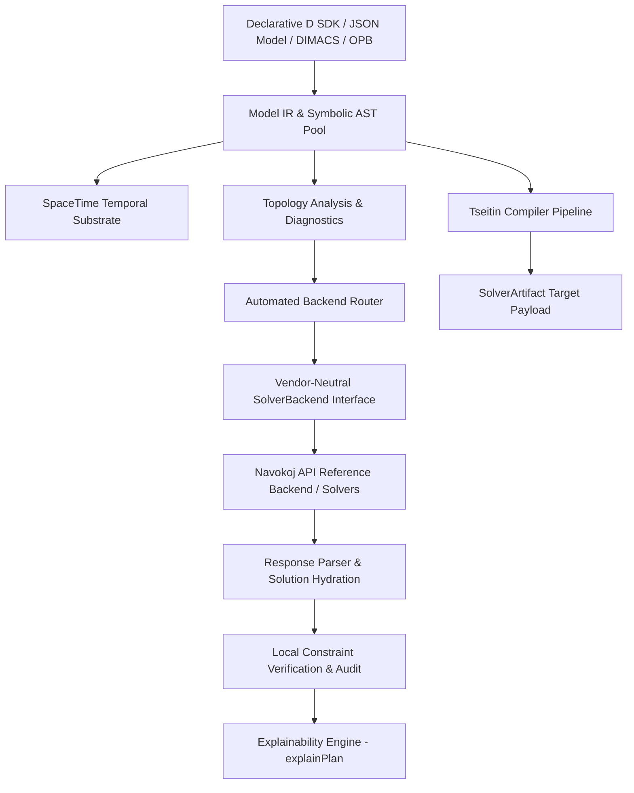

# Reify (`reify`)


**Reify** is a domain-neutral, declarative D SDK, decision compiler, and CLI toolchain for high-performance constraint intelligence engines.

In programming language theory, to *reify* is to turn an abstract concept into a concrete, executable object. **Reify** lets you declare symbolic variables, constraints, preferences, and objectives once. The compiler then reifies possible decision spaces into concrete solver artifacts (`SolverArtifact`)—automatically selecting an optimal backend target representation (CNF, WCNF, Hybrid CNF+XOR, Q-State, or OPB), querying account entitlements, submitting to local solvers or API backends, hydrating solution assignments, and locally verifying all constraints before returning.

Execution is vendor-neutral: `SolverBackend` owns execution, while `SolverResponseParser` handles response decoding. Reify includes reference support for the **Navokoj Decision Substrate**, along with pluggable support for OR-Tools, Z3, or custom backends without modifying domain models.

---

## Key Features

- **Declarative D SDK**: Imports cleanly via `import reify;`.
- **Vendor-Neutral Architecture**: Decoupled `SolverBackend` and `SolverResponseParser` interfaces separate decision modeling from solver execution.
- **Dynamic Capability Discovery**: Queries real-time account limits (`maxVariables`, `maxClauses`, allowed engines, remaining credits, hardware access).
- **Multi-Format Ingestion & Export**: Supports declarative JSON model documents, DIMACS CNF/WCNF, and linear OPB files/streams.
- **Rich Decision Types**: Native support for Boolean, categorical (single-hot), and order-encoded bounded integer decision variables.
- **SpaceTime Policy Framework**: Relational temporal projection over decision spaces using composable scheduling recipes (`duration`, `within`, `before`, `nonOverlapping`, `capacity`, `prefer`).
- **Transparent Explainability (`explainPlan()`)**: End-to-end auditability across pre-compilation logical plans, physical routing/encoding plans, execution traces, and causality explanations.
- **Automated Backend Routing**: Deterministic selection between Q-State (continuous manifold), Nitro MaxSAT (GPU), SUTRA (CPU micro-kernel for 100M+ clauses), or NitroSAT v3 (hybrid CNF+XOR with Gaussian elimination).
- **Local Solution Verification**: Hydrated variable assignments are independently verified against original domain constraints before presentation.

---

## Technical Architecture



### Core Subsystems

1. **Symbolic IR & Arena Memory (`reify.model`)**:
   - `ExpressionNode` AST covering logical connectives, comparisons, arithmetic, and N-ary primitives (`allDifferent`, `atMost`, `atLeast`, `exactly`).
   - `ExpressionNodePool` pre-allocates 16,384-node contiguous chunks to eliminate GC overhead.
2. **SpaceTime Temporal Substrate (`reify.spacetime`)**:
   - Relational candidate tuples structured via `Dimension` and `TimeDimension`.
   - High-level scheduling recipes: `duration`, `within`, `before`, `nonOverlapping`, `capacity`, and `prefer`.
3. **Explainability Engine (`reify.explain`)**:
   - `LogicalPlan`, `PhysicalPlan`, `ExecutionTrace`, and assignment causality via `explainPlan()`.
4. **Lowering & Codec Pipeline (`reify.compiler`, `reify.dimacs`, `reify.opb`)**:
   - $O(N)$ Tseitin CNF conversion, OPB linear pseudo-Boolean serialization (with `BigInt` normalization), and DIMACS parsing/generation.
5. **Automated Backend Router (`reify.router`)**:
   - Deterministic engine selection based on problem topology.

---

## Engine Selection Matrix

| Structural Signature | Recommended Engine | Target Hardware | Rationale |
| :--- | :--- | :--- | :--- |
| **Categorical + All-Diff** | `qstate` | Accelerated GPU | Direct N-ary state satisfaction on continuous manifolds |
| **Massive CNF (> 5M clauses)** | `nitro` | CPU Native (SUTRA) | C micro-kernel handles 100M+ clauses natively |
| **Heavy WCNF / Soft Constraints** | `nitro` | High-Memory GPU | Continuous Riemannian MaxSAT manifold solver |
| **Hybrid XOR Parity Systems** | `hybrid` | Accelerated GPU | NitroSAT v3 with integrated Gaussian elimination |
| **Standard Symbolic (< 100k clauses)**| `nitro` | CPU Native | Low-latency SUTRA CPU path |

---

## Developer Quickstart

### 1. Build the CLI Toolchain

**Using LDC2 (Recommended):**
```bash
ldc2 -i -Isource source/app.d -of=build/reify
```

**Using Dub:**
```bash
dub build --config=cli
```

### 2. Configure API Authentication

```bash
export NAVOKOJ_API_KEY=$(cat .public_api_key)
```

### 3. CLI Workflow Commands

```bash
# Query account capabilities & entitlements
build/reify capabilities

# Analyze model topology & get routing recommendations
build/reify analyze --input examples/crop-allocation.json

# Validate JSON schema compliance locally
build/reify validate --input examples/crop-allocation.json

# Compile to solver payload without spending credits
build/reify compile --input examples/crop-allocation.json

# Solve model and locally verify solution
build/reify solve --input examples/crop-allocation.json --engine nitro --timeout 10

# Perform DEFEKT physics-informed diagnostics
build/reify diagnose --input examples/crop-allocation.json
```

---

## D SDK Examples

### Declarative Optimization Model

```d
import reify;

auto app = decisionApp("crop-allocation", (Model model) {
    auto crops = ["wheat", "chickpea", "rice"];
    auto acres = model.integerVars("acres", 0, 100, crops);

    IntExpr[] planted;
    foreach (crop; crops) {
        planted ~= acres[crop];
    }

    // Hard land capacity constraint
    model.require("field capacity", lessEqual(sumExpr(planted), integer(100)));

    // Linear profit objective
    model.maximize("expected profit",
        30 * acres["wheat"] +
        22 * acres["chickpea"] +
        18 * acres["rice"]
    );
});

int main(string[] args) {
    return app.run(args);
}
```

### SpaceTime Scheduling & Plan Audit

```d
import reify;

alias PatientDim  = Dimension!("patient", Patient);
alias DoctorDim   = Dimension!("doctor", Doctor);
alias ActivityDim = Dimension!("activity", Activity);
alias SlotDim     = TimeDimension!("slot", Slot);

auto spaceTime = model
    .spaceTime!(PatientDim, DoctorDim, ActivityDim, SlotDim)("surgery")
    .dimension!PatientDim(patients)
    .dimension!DoctorDim(doctors)
    .dimension!ActivityDim(activities)
    .time!SlotDim(slots)
    .build();

spaceTime.duration!ActivityDim(Activity.preop, 1);
spaceTime.duration!ActivityDim(Activity.surgery, 2);

auto noDoctorCollision = nonOverlapping!DoctorDim().within(timeWindow(workingHours));
auto surgeryPolicy = exactlyOnePer!(PatientDim, ActivityDim)()
    .and(noDoctorCollision)
    .and(capacity(DoctorDim.name, 1))
    .and(prefer!DoctorDim(Doctor.master, 20));

spaceTime.apply(surgeryPolicy);
spaceTime.before("preop", "surgery", "patient");

// Explain plans
auto logicalPlan  = spaceTime.explainPlan();
auto physicalPlan = spaceTime.explainPhysical();

logicalPlan.print();
physicalPlan.print();
```

---

## Universal JSON Model Format

Models can also be declared in standard JSON conforming to [`schema/navokoj-model.schema.json`](schema/navokoj-model.schema.json):

```json
{
  "name": "crop-allocation",
  "variables": [
    {"name": "wheat", "type": "integer", "lower": 0, "upper": 100},
    {"name": "chickpea", "type": "integer", "lower": 0, "upper": 100}
  ],
  "constraints": [
    {
      "name": "land capacity",
      "level": "hard",
      "expression": {
        "op": "le",
        "left": {"op": "sum", "args": ["wheat", "chickpea"]},
        "right": 100
      }
    }
  ],
  "objectives": [
    {
      "name": "expected profit",
      "sense": "maximize",
      "expression": {
        "op": "sum",
        "args": [
          {"op": "mul", "left": 30, "right": "wheat"},
          {"op": "mul", "left": 22, "right": "chickpea"}
        ]
      }
    }
  ]
}
```

---

## Directory Structure & Module Matrix

| Path | Description |
| :--- | :--- |
| `source/app.d` | CLI application entry point (`reify` executable) |
| `source/reify/package.d` | Primary SDK module re-exporting public APIs |
| `source/reify/model.d` | Core AST, decision variables, and arena memory pool |
| `source/reify/compiler.d` | Tseitin lowering pipeline and compilation |
| `source/reify/spacetime.d` | SpaceTime temporal dimension & scheduling framework |
| `source/reify/explain.d` | Transparent plan explainability engine (`explainPlan`) |
| `source/reify/router.d` | Automated solver backend router |
| `source/reify/diagnostics.d` | Structural analysis, Chebyshev bias, and Betti numbers |
| `source/reify/formula.d` | Low-level symbolic CNF/WCNF formula abstractions |
| `source/reify/dimacs.d` | DIMACS CNF/WCNF parser and generator |
| `source/reify/opb.d` | Pseudo-Boolean (OPB) parser, serializer, and BigInt normalizer |
| `source/reify/navokoj/` | Reference `NavokojBackend`, HTTP API client, and response parsers |
| `source/reify/transport.d` | `HttpTransport` interface and libcurl wrapper |
| `schema/navokoj-model.schema.json` | Draft 2020-12 JSON Schema for universal decision models |
| `tests/` | Test suite harnesses (core, formula, spacetime, trust primitives) |
| `examples/` | Decision models (crop allocation, nurse scheduling, Sudoku, etc.) |

---

## Testing & Verification

Run the full test suite (423 assertions):

```bash
# 1. Core compiler & hydration tests (277 assertions)
ldc2 -i -Isource tests/test_runner.d -of=build/reify-tests && ./build/reify-tests

# 2. Formula mapping & Tseitin tests (44 assertions)
ldc2 -i -Isource tests/formula_mapping_tests.d -of=build/formula-mapping-tests && ./build/formula-mapping-tests

# 3. SpaceTime scheduling recipe tests (34 assertions)
ldc2 -i -Isource tests/spacetime_tests.d -of=build/spacetime-tests && ./build/spacetime-tests

# 4. Trust primitive & explainability tests (68 assertions)
ldc2 -i -Isource tests/trust_primitive_tests.d -of=build/trust-tests && ./build/trust-tests
```

---

## License & Attribution

- **License**: Boost Software License 1.0 ([`LICENSE`](LICENSE)).
- **Authored By**: [ShunyaBar Labs](https://shunyabar.foo/).
- **Reference Substrate**: [Navokoj Decision Substrate](https://navokoj.shunyabar.foo/).
