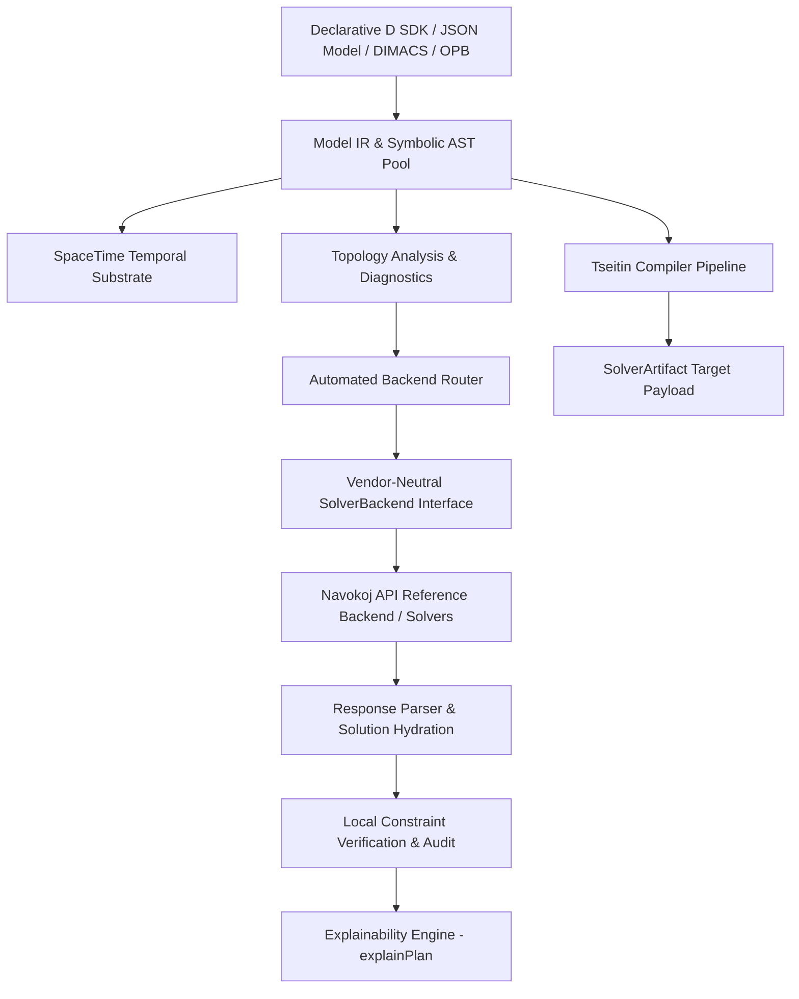

# Reify (`reify`)


**Reify** is a domain-neutral declarative D SDK, decision compiler, and CLI toolchain for high-performance constraint intelligence engines.

In programming language theory, to *reify* is to turn an abstract concept into a concrete, executable object. With **Reify**, a decision model declares symbolic variables, constraints, preferences, and objectives once. The compiler reifies possible problem worlds into concrete solver artifacts (`SolverArtifact`) — automatically selecting an optimal backend representation (CNF, WCNF, Hybrid CNF+XOR, Q-State, or OPB), querying account entitlements, submitting to the backend API or local solver, hydrating returned variable assignments, and locally verifying domain constraints.

Execution is vendor-neutral and extensible: `SolverBackend` owns solver execution, while `SolverResponseParser` owns response decoding. Reify ships with the reference `NavokojBackend` alongside support for OR-Tools, Z3, or custom solver backends without modifying domain models or SpaceTime policy definitions.

---

## Key Features

- **Declarative D SDK**: Clean import surface via `import reify;` (or custom backend extensions).
- **Vendor-Neutral Architecture**: Pluggable `SolverBackend` and `SolverResponseParser` interfaces decouple modeling from target solvers.
- **Dynamic Capability Discovery**: Live runtime query of account tier limits (`maxVariables`, `maxClauses`, allowed engines, remaining credits, hardware access).
- **Multi-Format Ingestion & Export**: Direct support for declarative JSON model documents, DIMACS CNF/WCNF, and linear OPB files or standard input streams.
- **Rich Decision Types**: Boolean, categorical (single-hot), and order-encoded bounded-integer decision variables.
- **SpaceTime Policy Framework**: Relational temporal projection over decision spaces with composable scheduling recipes (`duration`, `within`, `before`, `nonOverlapping`, `capacity`, `prefer`).
- **Transparent Plan Explainability (`explainPlan()`)**: Full-stack auditability across pre-compilation logical plans, physical routing/encoding plans, execution traces, and policy causality explanations.
- **Automated Backend Routing**: Deterministic topology-based selection between Q-State (continuous manifold), Nitro MaxSAT (H100 GPU), SUTRA (C CPU micro-kernel for 100M+ clauses), or NitroSAT v3 (hybrid CNF+XOR with Gaussian elimination).
- **Local Verification & Auditability**: Every returned solver assignment is hydrated and independently verified against original domain constraints before presentation.

---

## Technical Architecture & Subsystems



### 1. Symbolic Model IR & Arena Memory Management (`reify.model`)
- **Symbolic AST**: `ExpressionNode` representing `booleanConstant`, `integerConstant`, `variable`, logical connectives (`and`, `or`, `xor`, `implies`, `iff`), comparisons (`eq`, `ne`, `lt`, `le`, `gt`, `ge`), arithmetic (`add`, `sub`, `mul`, `neg`), and N-ary primitives (`allDifferent`, `atMost`, `atLeast`, `exactly`).
- **Arena Memory Allocation**: `ExpressionNodePool` pre-allocates 16,384-node contiguous chunks to eliminate GC overhead during symbolic AST construction.
- **Typed Decision Variables**:
  - `BoolExpr`: Propositional Boolean decision variables with operator overloading (`~`, `&`, `|`, `^`).
  - `IntExpr`: Order-encoded bounded integer variables ($[L, U]$) supporting symbolic linear arithmetic.
  - `CategoryExpr`: Categorical variables backed by finite state spaces, offering single-hot domain mappings (`equals`, `differs`, `same`, `different`).

### 2. SpaceTime Relational Temporal Substrate (`reify.spacetime`)
- **Kripke-Inspired Semantics**: Models finite decision spaces as possible worlds ($W$), temporal order and resource constraints as accessibility relations ($R$), and variable selections as truth valuations ($V$).
- **Typed & Dynamic Dimensions**: `Dimension!("name", Type)` and `TimeDimension!("slot", Slot)` structure relational candidate tuples.
- **Composable Recipe Engine (`ConstraintRecipe`)**:
  - `duration`: Assigns multi-slot temporal spans to activities, enforcing horizon boundaries.
  - `within`: Enforces discrete availability windows ($TimeWindow$).
  - `before`: Constructs binary temporal accessibility exclusion clauses ($\neg e \lor \neg l$).
  - `nonOverlapping`: Enforces pairwise mutual exclusion over shared resources.
  - `capacity`: Enforces maximum simultaneous occupancy limits ($k$) per resource/time slice via `atMost`.
  - `prefer`: Assigns soft preference weights for optimization objectives.

### 3. Transparent Explainability Engine (`reify.explain`)
- **`explainPlan()` Trust Primitive**: Provides multi-layered diagnostic visibility into decision models:
  - **`LogicalPlan`**: Pre-compilation relational space metrics, raw Cartesian sizes, filter selectivities, and semantic operations.
  - **`PhysicalPlan`**: Structural classification, clause count, $\alpha$ density ($M/N$), phase transition markers, recommended solver backends, and estimated VRAM/credit costs.
  - **`ExecutionTrace`**: Post-solve telemetry including engine used, hardware allocation, solve time, satisfaction rates, timeout flags, and billing charges.
  - **`DecisionExplanation`**: Causality audit for specific variable assignments, linking choices directly to violated constraints, variable blame scores, and domain-level semantic policies.

### 4. Dynamic Capability Discovery & Entitlements (`reify.navokoj.backend`, `reify.navokoj.client`)
- Queries real-time entitlement parameters from backend API endpoints (`/v1/capabilities`).
- Respects account constraints including `tier`, `engines`, `maxVariables`, `maxClauses`, `supportsSpaceTime`, `supportsHardClauseMask`, and `remainingCredits`.

### 5. Lowering Pipeline & Multi-Format Ingestion (`reify.compiler`, `reify.dimacs`, `reify.opb`, `reify.document`)
- **Tseitin Transformation**: Converts non-clause symbolic AST nodes into CNF in $O(N)$ time with auxiliary variables.
- **OPB Serialization/Parsing**: Native support for Pseudo-Boolean linear constraints with BigInt coefficient normalization.
- **DIMACS CNF/WCNF Handling**: Native parsing and generation with exact literal identity preservation.
- **JSON Schema Validation**: Schema verification backed by [`schema/navokoj-model.schema.json`](schema/navokoj-model.schema.json).

### 6. Automated Solver Backend & Hardware Router (`reify.router`)
Selection is automatic and deterministic based on problem characteristics:

| Structural Signature | Recommended Engine | Target Hardware | Description / Rationale |
| :--- | :--- | :--- | :--- |
| **Categorical + All-Diff** | `qstate` | Accelerated GPU | Direct N-ary state satisfaction on continuous manifolds |
| **Massive CNF (> 5M clauses)** | `nitro` | CPU Native (SUTRA) | SUTRA C engine handling 100M+ clauses natively |
| **Heavy WCNF / Soft Constraints** | `nitro` | High-Memory GPU | Continuous Riemannian MaxSAT manifold solvers |
| **Hybrid XOR Parity Systems** | `hybrid` | Accelerated GPU | NitroSAT v3 with integrated Gaussian elimination |
| **Standard Symbolic (< 100k clauses)**| `nitro` | CPU Native | Low-latency SUTRA CPU micro-kernel |

---

## Using Navokoj with Reify

**Navokoj** is the reference decision substrate backend for **Reify**. The repository includes a public API key file for testing (`.public_api_key`).

### 1. Setting Up Authentication

Set the API key as an environment variable or pass it directly via CLI/SDK options:

```bash
# Load key from .public_api_key
export NAVOKOJ_API_KEY=$(cat .public_api_key)

# Or set manually with your API key
export NAVOKOJ_API_KEY="sample_api_key"
```

### 2. Solving Models via Reify CLI

```bash
# 1. Analyze model topology & get engine routing recommendation
build/reify analyze --input examples/crop-allocation.json

# 2. Compile model into backend JSON request payload without spending credits
build/reify compile --input examples/crop-allocation.json

# 3. Solve model via Navokoj Engine (Nitro / Q-State / Hybrid) with local solution verification
build/reify solve \
  --input examples/crop-allocation.json \
  --api-key $(cat .public_api_key) \
  --engine nitro \
  --timeout 10

# 4. Perform physics-informed DEFEKT diagnostics (Chebyshev bias & Betti numbers)
build/reify diagnose \
  --input examples/crop-allocation.json \
  --api-key $(cat .public_api_key)
```

### 3. Solving Models via D SDK

```d
import reify;
import std.json : parseJSON;
import std.stdio : writeln;

void main() {
    // Define decision model
    auto app = decisionApp("nurse-scheduling", (Model model) {
        auto nurseA = model.booleanVar("nurse_alpha");
        auto nurseB = model.booleanVar("nurse_beta");
        
        // Hard constraint
        model.require("at_least_one_on_shift", nurseA | nurseB);
    });

    // Configure Navokoj API request options
    AppSolveOptions solveOptions;
    solveOptions.request.apiKey = "sample_api_key"; // Or reads NAVOKOJ_API_KEY from environment
    solveOptions.compilation.engine = "nitro";

    // Solve, hydrate, and locally verify constraints
    SolveResult result = app.solve(parseJSON("{}"), solveOptions);

    writeln("Solve Status: ", result.status);
    writeln("Feasible: ", result.verification.feasible);
    
    // Inspect transparent execution trace
    ExecutionTrace trace = explainExecution(result);
    writeln("Engine Used: ", trace.selectedEngine);
    writeln("Solve Time (ms): ", trace.solveTimeMs);
}
```

---

## Directory Structure & Module Matrix

| Path | Description |
| :--- | :--- |
| [`source/app.d`](source/app.d) | CLI application entry point (`reify` executable) |
| [`source/reify/package.d`](source/reify/package.d) | Main SDK module re-exporting all public APIs |
| [`source/reify/model.d`](source/reify/model.d) | Core symbolic decision model AST, decision variables, and expression pool |
| [`source/reify/compiler.d`](source/reify/compiler.d) | Tseitin lowering, backend compilation, and model validation |
| [`source/reify/spacetime.d`](source/reify/spacetime.d) | SpaceTime relational temporal dimension & scheduling framework |
| [`source/reify/explain.d`](source/reify/explain.d) | Transparent plan explainability engine (`explainLogical`, `explainPhysical`, etc.) |
| [`source/reify/router.d`](source/reify/router.d) | Automated solver backend & engine routing recommendation engine |
| [`source/reify/diagnostics.d`](source/reify/diagnostics.d) | Structural analysis, $\alpha$ density, Chebyshev bias, and Betti numbers |
| [`source/reify/formula.d`](source/reify/formula.d) | Low-level symbolic CNF/WCNF formula abstractions |
| [`source/reify/dimacs.d`](source/reify/dimacs.d) | DIMACS CNF/WCNF format parser and generator |
| [`source/reify/opb.d`](source/reify/opb.d) | Pseudo-Boolean (OPB) linear constraint parser, serializer, and BigInt normalizer |
| [`source/reify/navokoj/`](source/reify/navokoj) | Reference `NavokojBackend`, HTTP API client, and response parsers |
| [`source/reify/transport.d`](source/reify/transport.d) | `HttpTransport` interface and libcurl-backed `CurlTransport` |
| [`schema/navokoj-model.schema.json`](schema/navokoj-model.schema.json) | Draft 2020-12 JSON Schema for universal decision model documents |
| [`tests/`](tests/) | Test suite (4 test harnesses: core runner, formula mapping, SpaceTime, trust primitives) |
| [`examples/`](examples/) | Example models (Nurse scheduling, crop allocation, surgery timetabling, Sudoku, graph coloring) |

---

## Developer Quickstart

### 1. Build the CLI Toolchain

Using **LDC2** (recommended):

```bash
# Build the reify executable
ldc2 -i -Isource source/app.d -of=build/reify
```

Using **Dub** (if installed):

```bash
dub build --config=cli
```

### 2. Discover Account Entitlements

Query authoritative account limits and engine access:

```bash
# Set your API key
export NAVOKOJ_API_KEY="nvkj_your_api_key_here"

# Query capabilities using the Reify CLI
build/reify capabilities
```

Output example:
```text
Tier: launch_pad
Engines: ["nano", "mini", "nitro", "pro"]
Max Variables: 1,000,000
Max Clauses: 8,000,000
Supports Hard Clause Mask: true
Supports Space-Time: true
Remaining Credits: $199.00
```

### 3. Reify, Validate, & Solve a Model

Validate model document structure locally without consuming API credits:

```bash
build/reify validate --input examples/crop-allocation.json
```

Inspect compiled backend request payload:

```bash
build/reify compile --input examples/crop-allocation.json
```

Submit, solve, hydrate, and verify locally:

```bash
build/reify solve \
  --input examples/crop-allocation.json \
  --timeout 5
```

---

## D Modeling API

### 1. Declarative Decision Model

```d
import reify;

auto app = decisionApp(
    "crop-allocation",
    (Model model) {
        auto crops = ["wheat", "chickpea", "rice"];
        auto acres = model.integerVars("acres", 0, 100, crops);

        IntExpr[] planted;
        foreach (crop; crops) {
            planted ~= acres[crop];
        }

        // Hard capacity constraint
        model.require(
            "field capacity",
            lessEqual(sumExpr(planted), integer(100))
        );

        // Linear profit objective
        model.maximize(
            "expected profit",
            30 * acres["wheat"] +
            22 * acres["chickpea"] +
            18 * acres["rice"]
        );
    }
);

int main(string[] args) {
    return app.run(args);
}
```

### 2. SpaceTime Scheduling Policies & Explainability

```d
import reify;

alias PatientDim  = Dimension!("patient", Patient);
alias DoctorDim   = Dimension!("doctor", Doctor);
alias ActivityDim = Dimension!("activity", Activity);
alias SlotDim     = TimeDimension!("slot", Slot);

auto spaceTime = model
    .spaceTime!(PatientDim, DoctorDim, ActivityDim, SlotDim)("surgery")
    .dimension!PatientDim(patients)
    .dimension!DoctorDim(doctors)
    .dimension!ActivityDim(activities)
    .time!SlotDim(slots)
    .build();

spaceTime.duration!ActivityDim(Activity.preop, 1);
spaceTime.duration!ActivityDim(Activity.surgery, 2);

auto noDoctorCollision = nonOverlapping!DoctorDim().within(timeWindow(workingHours));
auto surgeryPolicy = exactlyOnePer!(PatientDim, ActivityDim)()
    .and(noDoctorCollision)
    .and(capacity(DoctorDim.name, 1))
    .and(prefer!DoctorDim(Doctor.master, 20));

spaceTime.apply(surgeryPolicy);
spaceTime.before("preop", "surgery", "patient");

// Inspect transparent execution and physical plans
auto logicalPlan  = spaceTime.explainPlan();
auto physicalPlan = spaceTime.explainPhysical();

logicalPlan.print();
physicalPlan.print();
```

### 3. Low-Level CNF Formula Builder

```d
import reify;

auto formula = new CnfFormula("service-selection");
const gateway  = formula.newVariable("gateway");
const database = formula.newVariable("database");

formula.addClause([-gateway, database], "gateway needs database");
formula.addClause([gateway, database], "keep one entry point available");

auto compiled = formula.compile();
```

---

## Reify: Technical Introduction

Reify turns a declarative decision model into a solver artifact. You declare variables, constraints, and preferences once. The compiler lowers to CNF/WCNF/Hybrid CNF+XOR/Q-State/OPB, selects a backend via `router.d`, queries `/v1/capabilities` for tier limits, dispatches, hydrates assignments, and locally re-verifies all hard constraints before returning.

The SDK is `import reify;`. Backend execution is pluggable via `SolverBackend` and `SolverResponseParser`. The reference backend is `NavokojBackend`.

### Modeling in Practice

The canonical reference is [`examples/hard_benchmark_cnf.d`](examples/hard_benchmark_cnf.d) — 155 LoC modeling 24-workload placement across 8 servers in 4 fault domains with anti-affinity, co-location, HA isolation, capacity ≤6/server, and revenue-weighted tier preferences.

**High-level surface** — categorical placement with automatic ALO+AMO, channeled indicators only where clause-level is genuinely needed, and high-level relations that preserve intent for `explainPlan()`:

```d
CategoryExpr[24] place;
foreach (i; 0.. N)
    place[i] = model.categoricalVar(format("place[%s]", wk[i]), servers);

// Hard constraints via relations (intent preserved in LogicalPlan)
place[a].different(place[b])     // anti-affinity
place[6].same(place[4])          // co-location
implies(place[22].onRackD, place[21].onRackD)

// Capacity AMK ≤6 — the one place clause-level is genuinely required
foreach (s; 0..S) foreach (start; 0..N-6) {
    BoolExpr[] window; foreach (j; start..start+7) window ~= ~on[j][s];
    model.requireClause(format("cap[%s,w%d]", servers[s], start), window);
}

// Three tiers: require = hard, medium = penalty, prefer = weighted MaxSAT
model.prefer("aff[w00,w01]", place[0].same(place[1]), 15.0);
```

### Compilation and Routing

`reify.compile()` Tseitin-transforms non-clause AST nodes, order-encodes bounded ints, and routes via `router.d` based on topology — categorical+all-different → `qstate`, massive CNF → SUTRA C micro-kernel, heavy WCNF → Nitro Riemannian MaxSAT, hybrid XOR → hybrid with Gaussian elimination.

The benchmark compiles to 192 booleans + channeling, 403 hard clauses, 25 weighted softs. Router selects `nitro` CPU Native (SUTRA) — `<100k` clauses, low-latency path. Reported solve time on this benchmark: 223 ms, 99.95% satisfaction after local re-verification.

All hard constraints are re-verified locally against the original `Model` — solver output is not trusted. `ExecutionTrace` contains `selectedEngine`, `solveTimeMs`, billing, and routing decisions.

See [`examples/hard_benchmark_cnf.d`](examples/hard_benchmark_cnf.d) for the full walkthrough.

---

## Universal Model Document Format

Models can be submitted directly as JSON documents conforming to [`schema/navokoj-model.schema.json`](schema/navokoj-model.schema.json):

```json
{
  "name": "crop-allocation",
  "variables": [
    {"name": "wheat", "type": "integer", "lower": 0, "upper": 100},
    {"name": "chickpea", "type": "integer", "lower": 0, "upper": 100}
  ],
  "constraints": [
    {
      "name": "land capacity",
      "level": "hard",
      "expression": {
        "op": "le",
        "left": {"op": "sum", "args": ["wheat", "chickpea"]},
        "right": 100
      }
    }
  ],
  "objectives": [
    {
      "name": "expected profit",
      "sense": "maximize",
      "expression": {
        "op": "sum",
        "args": [
          {"op": "mul", "left": 30, "right": "wheat"},
          {"op": "mul", "left": 22, "right": "chickpea"}
        ]
      }
    }
  ]
}
```

---

## Testing & Verification Benchmarks

The full test suite consists of **4 distinct test harnesses** verified using **LDC2**:

```bash
# 1. Core compiler and hydration unit tests (277 assertions)
ldc2 -i -Isource tests/test_runner.d -of=build/reify-tests && ./build/reify-tests

# 2. Formula mapping & Tseitin transformation tests (44 assertions)
ldc2 -i -Isource tests/formula_mapping_tests.d -of=build/formula-mapping-tests && ./build/formula-mapping-tests

# 3. SpaceTime temporal scheduling recipe tests (34 assertions)
ldc2 -i -Isource tests/spacetime_tests.d -of=build/spacetime-tests && ./build/spacetime-tests

# 4. Trust primitive & plan explainability tests (68 assertions)
ldc2 -i -Isource tests/trust_primitive_tests.d -of=build/trust-tests && ./build/trust-tests
```

**Total Test Coverage: 423 / 423 Assertions PASS**

---

## License

The **Reify** D compiler project is distributed under the **Boost Software License 1.0** (`BSL-1.0`); see [`LICENSE`](LICENSE).

---

## Author & Ecosystem

Authored by **[ShunyaBar Labs](https://shunyabar.foo/)**.

**Reify** has built-in reference support for the **[Navokoj Decision Substrate](https://navokoj.shunyabar.foo/)**, enabling zero-configuration integration with high-performance continuous MaxSAT, Q-State, and SUTRA solver engines.