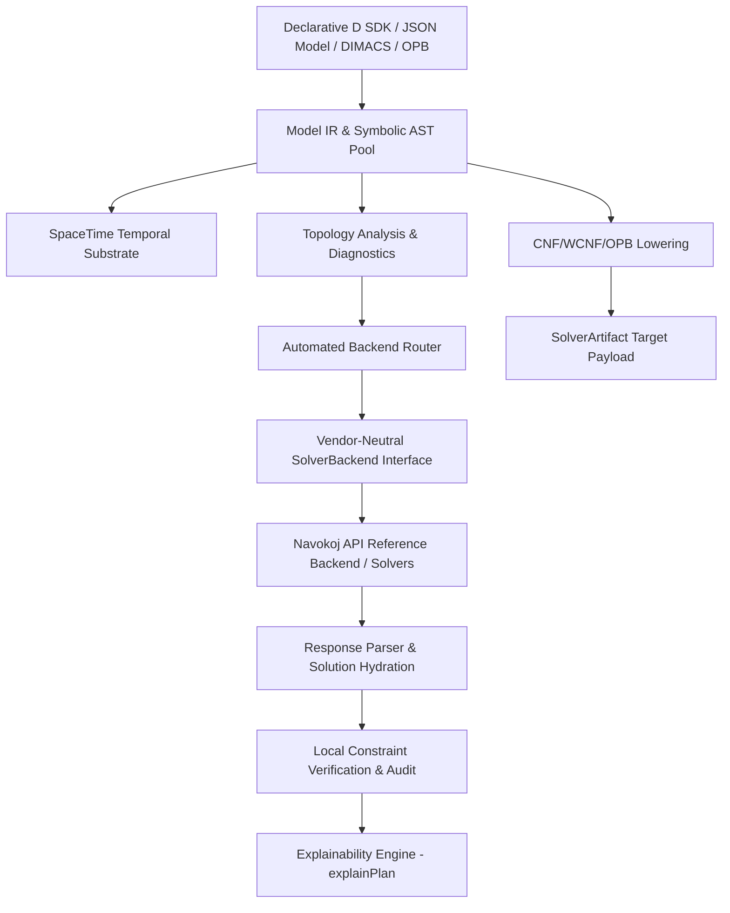

# Engineer's Guide

For deep dives into architecture, implementation details, and CLI reference, see below. For a quick product overview, start at the [README](../README.md).

---

## Technical Architecture



### Core Subsystems

1. **Symbolic IR & Arena Memory (`reify.model`)**
   - `ExpressionNode` AST covering logical connectives, comparisons, arithmetic, and N-ary primitives
   - `ExpressionNodePool` pre-allocates 16,384-node contiguous chunks to eliminate GC overhead

2. **SpaceTime Temporal Substrate (`reify.spacetime`)**
   - Relational candidate tuples via `Dimension` and `TimeDimension`
   - Scheduling recipes: `duration`, `within`, `before`, `nonOverlapping`, `capacity`, `prefer`

3. **Explainability Engine (`reify.explain`)**
   - `LogicalPlan`, `PhysicalPlan`, `ExecutionTrace`, and assignment causality via `explainPlan()`

4. **Lowering & Codec Pipeline (`reify.compiler`, `reify.dimacs`, `reify.opb`)**
   - CNF conversion, OPB serialization, and DIMACS parsing/generation

5. **Automated Backend Router (`reify.router`)**
   - Deterministic engine selection based on problem topology

---

## Engine Selection

Reify automatically picks the best engine for your problem:

| Problem Type | Engine | Hardware | Best For |
| :--- | :--- | :--- | :--- |
| Categorical + All-Diff | `qstate` | GPU | Graph coloring, assignment |
| Large CNF (>5M clauses) | `nitro` | CPU | Enterprise scheduling, timetabling |
| Soft Constraints / WCNF | `nitro` | GPU H100 | Weighted optimization |
| XOR-heavy formulas | `hybrid` | GPU | Parity constraints |
| Standard (<100k clauses) | `nitro` | CPU | Low-latency interactive |

---

## CLI Reference

```bash
# Build the CLI
ldc2 -i -Isource source/app.d -of=build/reify

# Or via dub
dub build --config=cli

# Commands
reify capabilities              # Check account limits and entitlements
reify analyze --input <file>   # Model topology and routing advice
reify validate --input <file> # Schema compliance check
reify compile --input <file>   # Generate solver payload (no API call)
reify solve --input <file>    # Solve and verify locally
reify diagnose --input <file> # Physics-informed diagnostics
```

---

## Directory Structure

| Path | Description |
| :--- | :--- |
| `source/app.d` | CLI entry point |
| `source/reify/package.d` | SDK module exports |
| `source/reify/model.d` | Core AST, decision variables |
| `source/reify/compiler.d` | Lowering pipeline |
| `source/reify/spacetime.d` | Temporal scheduling |
| `source/reify/explain.d` | Plan explainability |
| `source/reify/router.d` | Backend routing |
| `source/reify/diagnostics.d` | Topology analysis |
| `source/reify/formula.d` | CNF/WCNF abstractions |
| `source/reify/dimacs.d` | DIMACS parser/generator |
| `source/reify/opb.d` | OPB parser/serializer |
| `source/reify/navokoj/` | Reference backend client |
| `tests/` | Test suite (423 assertions) |
| `examples/` | Decision model examples |

---

## Testing

```bash
# Core + hydration
ldc2 -i -Isource tests/test_runner.d -of=build/reify-tests && ./build/reify-tests

# Formula mapping
ldc2 -i -Isource tests/formula_mapping_tests.d -of=build/formula-mapping-tests && ./build/formula-mapping-tests

# SpaceTime
ldc2 -i -Isource tests/spacetime_tests.d -of=build/spacetime-tests && ./build/spacetime-tests

# Trust + explainability
ldc2 -i -Isource tests/trust_primitive_tests.d -of=build/trust-tests && ./build/trust-tests
```

---

## Concepts Glossary

| Academic Term | Domain Term | What It Means |
| :--- | :--- | :--- |
| SAT / Boolean Satisfiability | Decision / Assignment | Finding values (true/false) that satisfy all rules |
| CNF | Clause Format | How decisions are encoded for solvers |
| WCNF | Weighted Decisions | Some decisions are "nice to have" (soft), others "must have" (hard) |
| MaxSAT | Soft Optimization | Find the best solution that violates fewest soft rules |
| Tseitin transformation | CNF Lowering | Converting logical rules into solver-friendly format |
| Variable ordering | Order Encoding | Representing integers (0-100) as true/false comparisons |
| Clause | Rule | A single constraint that must be satisfied |
| Literal | Decision | A single boolean choice (true or false) |
| At-most-one (AMO) | "Pick at most one" | No more than one item selected from a set |
| At-least-one (ALO) | "Pick at least one" | One or more items must be selected |
| AllDifferent | "All different" | No two items share the same value |
| XOR / Parity | Parity constraint | An odd/even number of things must be true |
| CDCL | Search-based solving | Traditional SAT solver approach |
| Local search | Neighborhood search | Iteratively improve a candidate solution |
| Hydration | Solution Mapping | Converting solver numbers back to domain names |
| Verification | Local Check | Re-running constraints against the answer to confirm it's correct |
| Explainability | Audit Trail | Why did the solver pick this answer? |

---

## Related

- [NAVOKOJ.md](../NAVOKOJ.md) — Why Navokoj powers the default backend
- [examples/](../examples/) — Working decision models
- [schema/](../schema/) — JSON model schema
